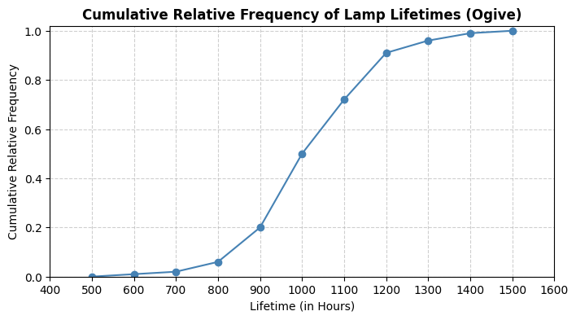
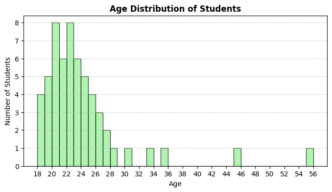
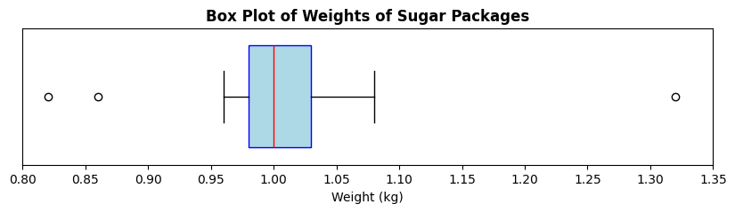

<h1 align="center">Øvelser 6: Beskrivende Statistik</h1>

I skal lave øvelserne inden torsdagens undervisning. Det er en fordel at arbejde i grupper og drøfte opgaverne sammen. Det vigtigste er, at I forstår opgaverne og kan forklare dem til hinanden. På torsdag gennemgår vi opgaverne, og I skal være klar til at præsentere jeres løsninger for klassen.

### Python-løsning

[solutions06.ipynb](https://github.com/RBrooksDK/MSE1_25/blob/main/06/solutions06.ipynb)

### Øvelser

#### Øvelse 1: Klassificering efter typetal

Ud fra de følgende datasæt skal du klassificere hvert datasæt som unimodalt, multimodalt eller uden typetal.

1. {1,2,3,4,5} (1) 
{ .annotate }

    1. Ingen typetal

2. {220,220,250,280,300,300,350} (1) 
{ .annotate }

    1. Multimodal (220, 300)

3. {High, High, Medium, Low, High, Medium, Low, Critical} (1)
{ .annotate }

    1. Unimodal (High)

#### Øvelse 2: Klassificering af datatyper

Ud fra de følgende oplysninger skal du angive, om der er tale om kvalitativ eller kvantitativ data, og hvis det er kvantitativt, om det er diskret eller kontinuert.

1. Antal studerende i en klasse (1) 
{ .annotate }

    1. Kvantitativ, diskret

2. Temperatur i Celsius (1)
{ .annotate }

    1. Kvantitativ, kontinuert

3. Typer af frugter i en kurv (1)
{ .annotate }

    1. Kvalitativ

4. Højder af personer i centimeter (1)
{ .annotate }

    1. Kvantitativ, kontinuert

5. Bilfarver på en parkeringsplads (1)
{ .annotate }

    1. Kvalitativ

#### Øvelse 3: Beregning ud fra diagram

Se diagrammet ovenfor, der viser den kumulerede relative frekvens for levetiden af lamper (i timer). Brug diagrammet til at besvare følgende spørgsmål:

1. Hvilken type diagram vises? (1)
{ .annotate }

    1. Ogive (kumuleret relativ frekvensgraf)

2. Hvad er medianlevetiden for lamperne? (1)
{ .annotate }

    1. Cirka 1000 timer

3. Estimér første og tredje kvartil (Q1 og Q3) for lampelevetiderne. (1)
{ .annotate }

    1. Q1 ≈ 900 timer, Q3 ≈ 1100 timer

4. Hvad er interkvartilområdet (IQR) for lampelevetiderne? (1)
{ .annotate }

    1. IQR ≈ 200 timer (Q3 - Q1)

5. Identificér eventuelle potentielle outliers i lampelevetiderne ved hjælp af 1.5·IQR-reglen.

    ??? answer "&nbsp;"

        Værdier under 600 timer eller over 1400 timer kan betragtes som milde outliers. Værdier under 300 timer eller over 1700 timer kan betragtes som ekstreme outliers.

#### Øvelse 4: Centrale målinger (Python)

Følgende datasæt viser alderen på 57 studerende i en klasse:

{18, 18, 18, 18, 19, 19, 19, 19, 19, 20, 20, 20, 20, 20, 20, 20, 20, 21, 21, 21, 21, 21, 21, 22, 22, 22, 22, 22, 22, 22, 22, 23, 23, 23, 23, 23, 23, 24, 24, 24, 24, 24, 25, 25, 25, 25, 26, 26, 26, 27, 27, 28, 30, 33, 35, 45, 55}

1. Lav en frekvenstabel for dataene.

    ??? answer "&nbsp;"

        | Alder | Frekvens |
        |-------|----------|
        | 18    | 4        |
        | 19    | 5        |
        | 20    | 8        |
        | 21    | 6        |
        | 22    | 8        |
        | 23    | 6        |
        | 24    | 5        |
        | 25    | 4        |
        | 26    | 3        |
        | 27    | 2        |
        | 28    | 1        |
        | 30    | 1        |
        | 33    | 1        |
        | 35    | 1        |
        | 45    | 1        |
        | 55    | 1        |

2. Plot et histogram for dataene.

    ??? answer "&nbsp;"

        

3. Hvordan hænger frekvenstabellen og histogrammet sammen?

    ??? answer "&nbsp;"

        Frekvenstabellen viser de numeriske optællinger af hver alder, mens histogrammet giver en visuel repræsentation af de samme data. Højden på hver søjle svarer til frekvensen for den pågældende alder.

4. Beregn variationsbredden for aldrene. (1)
{ .annotate }

    1. 37

5. Beregn middelværdi (1), median (2), prøvevarians (3) og prøvestandardafvigelse. (4)
{ .annotate }

    1. Middelværdi: \(23.60\)
    2. Median: \(22\)
    3. Prøvevarians: \(38.74\)
    4. Prøvestandardafvigelse: \(6.22\)

6. Find \(P_{10}\) (1), \(P_{90}\) (2) og interkvartilområdet (IQR). (3)
{ .annotate }

    1. \(P_{10} = 19\)
    2. \(P_{90} = 27.4\)
    3. \(IQR = 5\)

7. Identificér milde og ekstreme outliers. (1)
{ .annotate }

    1. Milde outliers: 33, 35; ekstreme outliers: 45, 55

8. Den empiriske regel (normalitetstjek). Sammenlign andelen af studerende inden for 1, 2 og 3 standardafvigelser fra middelværdien med 68.3–95.4–99.7%-reglen.

    ??? answer "&nbsp;"

        - Inden for 1 standardafvigelse (17.37 til 29.82): 91.23%
        - Inden for 2 standardafvigelser (11.15 til 36.05): 96.49%
        - Inden for 3 standardafvigelser (4.92 til 42.27): 96.49%

        Dataene følger ikke præcist den empiriske regel, hvilket indikerer, at de sandsynligvis ikke er normalfordelte.
    
9. Undersøg histogrammet for skævhed. (1)
{ .annotate }

    1. Histogrammet viser højreskævhed (positiv skævhed) med en længere hale mod højre.

#### Øvelse 5: Boxplot (Python)

En fabrik fylder 1 kg poser med sukker. Vægtene af en prøve på 20 poser er vist nedenfor (i kg):

{1.00, 1.01, 1.05, 0.99, 0.97, 1.01, 0.98, 0.99, 1.06, 1.06, 0.96, 1.00, 1.03, 0.97, 1.00, 0.99, 1.08, 1.01, 1.32, 0.82, 0.86}

Boxplottet nedenfor viser fordelingen af vægtene:

1. Identificér medianvægten ud fra boxplottet. (1)
{ .annotate }

    1. Median ≈ 1.00 kg

2. Estimér første (Q1) og tredje (Q3) kvartil. (1)
{ .annotate }

    1. Q1 ≈ 0.98 kg, Q3 ≈ 1.03 kg

3. Beregn interkvartilområdet (IQR). (1)
{ .annotate }

    1. IQR ≈ 0.05 kg

4. Beregn variationsbredden for vægtene. (1)
{ .annotate }

    1. Variationsbredde ≈ 0.5 kg

5. Forklar, hvad outliers repræsenterer i denne sammenhæng.

    ??? answer "&nbsp;"

        Outliers repræsenterer poser, der er markant underfyldte eller overfyldte i forhold til de fleste andre poser.

6. Hvad kunne outliers indikere om fabrikkens fyldningsproces?

    ??? answer "&nbsp;"

        Outliers kan indikere uregelmæssigheder i fyldningsprocessen, fx udstyrsfejl eller menneskelige fejl. De peger ikke nødvendigvis på unøjagtige målinger, men på variationer i selve fyldningsprocessen.

7. Ud fra boxplottet, vurder om vægtfordelingen er symmetrisk eller skæv. (1)
{ .annotate }

    1. Boxplottet ser en smule højreskævt ud.

8. Forklar, hvordan middelværdi, typetal og median typisk forholder sig i en højreskæv fordeling. (1)
{ .annotate }

    1. I en højreskæv fordeling gælder normalt: middelværdi > median > typetal.

#### Øvelse 6: Den empiriske regel (Python)

For hvert datasæt nedenfor skal du vurdere, om dataene ser cirka normalfordelte ud.

Brug den empiriske regel (68.3–95.4–99.7%) til at begrunde dit svar.

1. Responstider (ms) – middelværdi = 300, SD = 50, inden for 1 SD: 55%, inden for 2 SD: 78%, inden for 3 SD: 90% (1)
{ .annotate }

    1. Ikke normalfordelt

2. Antal fejlrapporter pr. uge – middelværdi = 12, SD = 4, inden for 1 SD: 68%, inden for 2 SD: 94%, inden for 3 SD: 99% (1)
{ .annotate }

    1. Cirka normalfordelt

3. Eksamensresultater: {55, 60, 62, 65, 68, 70, 72, 75, 78, 80, 82, 85, 88, 90, 92, 95} (1)
{ .annotate }

    1. Cirka normalfordelt

4. Daglige skridttællinger (i tusinder): {3, 4, 5, 6, 7, 8, 9, 10, 11, 12, 13, 14, 15} (1)
{ .annotate }

    1. Ikke normalfordelt

### Udfordringsøvelser

#### Udfordring 1: “German Tank”-problemet (serienumre)

En militær efterretningsenhed opsnapper serienumre fra fjendtlige kampvogne. Numrene er sekventielle fra 1 til et ukendt maksimum \(N\). I et sammenstød observerer de (usorteret):
\(\{12, 38, 71, 5, 44, 73, 29, 55\}\).

Lad \(n\) være stikprøvestørrelsen og \(m\) det største observerede nummer. Beregn \(n\) og \(m\). (1)  
{ .annotate }

1. \(n=8,\ m=73\)

To estimater for \(N\):  

MLE: \(\hat N_{\text{MLE}} = m\)  

Uafhængig: \(\hat N_{\text{U}} = m\cdot\frac{n+1}{n}-1\)  

Beregn begge og giv et heltalsestimat.

??? answer "&nbsp;"

    MLE: \(\hat N_{\text{MLE}} = 73\)

    Uafhængig: \(\hat N_{\text{U}} = 73 \cdot \frac{9}{8} - 1 = 81.125 \approx 81\)

Antag, at enheden senere observerer en ny prøve med \(n=10\) og \(m=79\). Uden at beregne alt forfra, forklar hvilken estimator du ville stole mest på i forhold til bias, og hvorfor.  

??? answer "&nbsp;"

    Den uafhængige estimator reducerer den systematiske undervurdering af \(N\), der findes i \(m\). Derfor bør \(\hat N_{\text{U}}\) foretrækkes, da den har lavere bias.

Beregn andelen af ikke-observerede kampvogne ud fra dit valgte \(\hat N\): \((\hat N - m)/\hat N\). Fortolk resultatet. 

??? answer "&nbsp;"

    Ved brug af \(\hat N_{\text{U}} = 81\): Andel ikke set = \((81 - 79)/81 \approx 0.0247\) eller ca. 2.47%. Det betyder, at omkring 2.47% af den samlede produktion ikke er blevet observeret i stikprøven.

Udled en ensidet 95% øvre grænse for \(N\) ud fra \( \mathbb{P}(M\le m)=(m/N)^n \), og sammenlign med dine punktestimater.

??? answer "&nbsp;"

    Løsningen af \( (m/N)^n = 0.95 \) for \(N\) giver \( N = m / (0.95^{1/n}) \). For \(m=79\) og \(n=10\) giver dette \( N \approx 79 / (0.95^{0.1}) \approx 79.4 \). Den ensidede 95% øvre grænse for \(N\) er derfor omkring 80, hvilket ligger tæt på det uafhængige estimat på 81.

Overvej, hvordan beskrivende statistik kan bruges til at analysere andre aspekter af dataene – for eksempel hvad hvis fjenden bevidst springer serienumre over?

[3 min YT Video](https://www.youtube.com/watch?v=WLCwMRJBhuI)

#### Udfordring 2: Simpsons paradoks i optagelsesdata

Et universitet gennemfører en optagelsesproces for to afdelinger. Hver afdeling optager studerende under **Program A** og **Program B**. I hver afdeling har Program A en højere optagelsesrate end Program B, men samlet set har Program B en højere optagelsesrate.

Data:

| Afdeling | Program | Optaget | Ansøgere |
|----------|---------|---------|----------|
| X        | A       | 10      | 50       |
| X        | B       | 171     | 950      |
| Y        | A       | 19      | 950      |
| Y        | B       | 1       | 50       |

1. Beregn optagelsesraten for A og B i hver afdeling. Angiv vinderen **inden for hver afdeling**.

    ??? answer "&nbsp;"

        Afd. X: A \(=10/50=20\%\), B \(=171/950=18\%\) → A vinder  
        Afd. Y: A \(=19/950=2.0\%\), B \(=1/50=2.0\%\) → Uafgjort

2. Beregn **de samlede** optagelsesrater for A og B. Hvem vinder samlet?

    ??? answer "&nbsp;"

        A \(=(10+19)/(50+950)=29/1000=2.9\%\)  
        B \(=(171+1)/(950+50)=172/1000=17.2\%\) → **B vinder samlet**

3. Forklar præcist, hvorfor dette **ikke** er i modstrid med de tidligere resultater. Brug begrebet vægtet gennemsnit.  

    ??? answer "&nbsp;"

        Den samlede rate er et vægtet gennemsnit af afdelingsspecifikke rater med **forskellige vægte**. A’s ansøgere er primært i den sværere afdeling, mens B’s ansøgere er i den lettere. Denne ubalance vender det samlede resultat — **Simpsons paradoks**.

4. Giv en statistisk forsvarlig beslutningsregel for at undgå at blive vildledt, og beregn det korrekte samlede resultat ud fra den regel. 

    ??? answer "&nbsp;"

        **Stratificér** efter afdeling og sammenlign programmer inden for hver afdeling; kombiner derefter med **fælles vægte** (fx ligelig vægtning) eller brug en regression med afdeling som kovariat. Hvis ansøgere var jævnt fordelt på tværs af af
