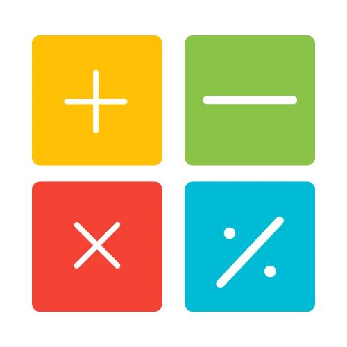

---
tags:
    - Projektarbejde
---

<h1 align="center">Projektarbejde</h1>

Denne session er tilegnet projektarbejde. I arbejder med jeres projekter og får mulighed for vejledning, sparring og at følge op på læringsmål i forhold til opgaven.

- {align=right : style="height:100px;width:150px"}
    
    **M1:** Her finder du læsemateriale, videoer og quizzer, der hjælper dig med at forberede dig til den første undervisning. Det er vigtigt at man som minimum har set videoerne.

    [:octicons-arrow-right-24: M1: Forberedelse](M1.md)

- {align=right : style="height:100px;width:150px"}

    **M2:** Her finder du de eksempler som jeg gennemgår til den første undervisningsgang og efterfølgende lægger jeg videoen op her også. Det er vigtigt at I har set videoerne fra M1 inden.
    
    [:octicons-arrow-right-24: M2: Undervisning 1](M2.md)

- {align=right : style="height:150px;width:150px"}

    **M3:** Her finder du de øvelser, som I skal lave enten selv eller i grupper. Der er også en række tutorials, der viser hvordan man kan gribe opgaverne an.

    [:octicons-arrow-right-24: M3: Øvelser](M3/index.md)

- {align=right : style="height:100px;width:150px"}

    **M4:** Her finder du materiale fra anden undervisnings-gang, herunder mine løsninger, og efterfølgende lægger jeg videoen op her også.
    
    [:octicons-arrow-right-24: M4: Undervisning 2](M4.md)

